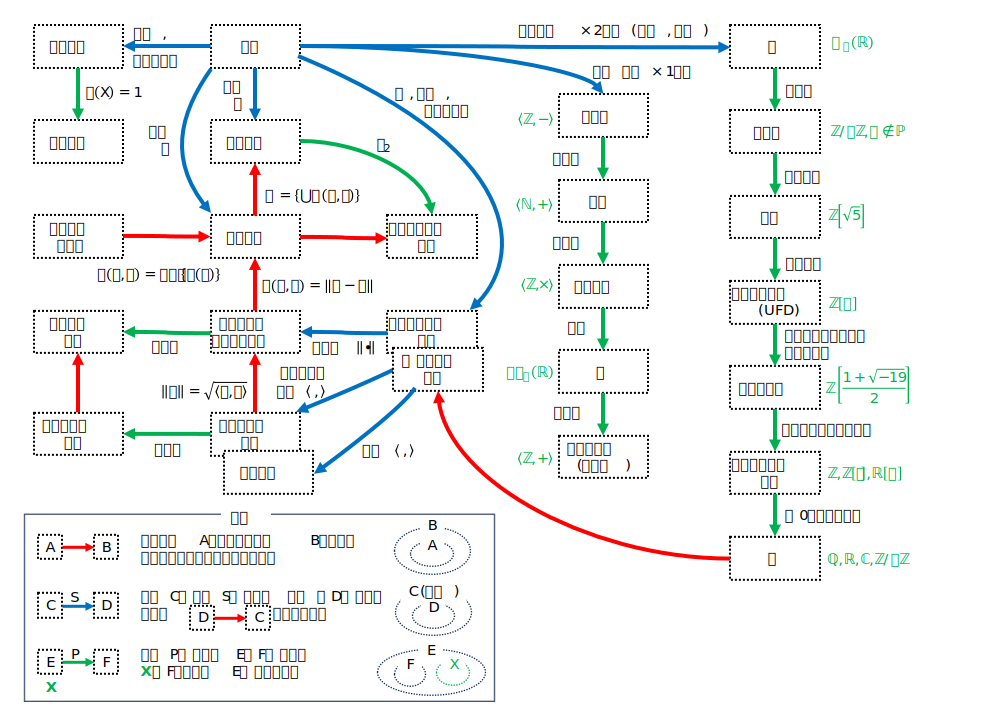

<html lang="ja">
    <head>
        <meta charset="utf-8" />
    </head>
    <body>
<h1>
Diagram of Abstract Algebra
</h1>
<h2>なにものか？</h2>

見通しの良い図を眺めて, 勉強しようと思う。 
・『<a href="https://www.math.wm.edu/~leemis/chart/UDR/UDR.html">確率分布曼荼羅</a>』は複雑すぎるので, <a href="https://www.reddit.com/r/math/comments/99y547/my_digram_of_abstract_algebra_and_other_stuff/?tl=es-es#lightbox">こっちの図</a> にした。 

<h3>[1] 図の日本語化</h3>

まずは, 日本語化してみた。

<h3>[2]この後, どうしたものか･･･</h3>

・赤矢印：A⇒Bとなる, という定理(Theorem) 
・青矢印：Aがある構造を持つ場合, Bと呼ぶという定義(Definitio) 
・緑矢印：Aがある性質を満たす場合, Bと呼ぶという定義(Definition)。反例つき 
 
まずは定義の <a href="https://boyoyon.github.io/Diagram_of_Abstract_Algebra/blue_arrows.html">青矢印</a> から。

    </body>
</html>
